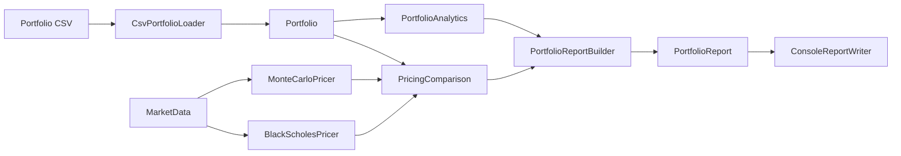

# QuantForge

[](https://github.com/NassimSahib/quantforge/actions/workflows/ci.yml)

**QuantForge** is a cross-platform C++20 quantitative finance project for pricing and analyzing portfolios of European options.

It combines financial modelling, modern C++, testing, performance engineering, and multithreading in one coherent codebase. QuantForge supports analytical **Black-Scholes pricing**, **Greeks**, sequential and parallel **Monte Carlo simulation**, portfolio aggregation, CSV ingestion, benchmarking, and automated cross-platform validation.

> **Project status:** v1.0 — stable first release. The codebase builds and passes its full test suite on **Windows/MSVC** and **Linux/GCC** through CMake and GitHub Actions.

---

## Highlights

- European **Call / Put** instruments
- Validated market-data domain objects
- Analytical **Black-Scholes pricing**
- Analytical **Delta, Gamma, Vega, Theta, Rho**
- Sequential Monte Carlo under risk-neutral GBM
- Parallel Monte Carlo using `std::jthread`
- Deterministic RNG through explicit seeds
- Long / short portfolio positions
- CSV portfolio ingestion
- Portfolio valuation and Greeks aggregation
- Black-Scholes vs Monte Carlo comparison
- Console reporting
- Release-mode performance benchmarks
- Monte Carlo scaling benchmarks
- CMake cross-platform build system
- Windows / MSVC support
- Linux / GCC support
- **141 GoogleTest tests**
- GitHub Actions CI on Windows and Ubuntu

---

## Performance snapshot

Benchmarks below were measured on the development machine in optimized **Release** builds.

Results are machine-, compiler-, operating-system-, and workload-dependent and should not be interpreted as universal performance claims.

### Pricing benchmark

Scenario:

```text
European Call
S = 120
K = 100
T = 1 year
r = 5%
q = 2%
sigma = 20%
```

#### Windows / MSVC

| Engine | Workload | Average time | Throughput |
|---|---:|---:|---:|
| Black-Scholes | 1,000,000 prices | **57.54 ns / price** | — |
| Monte Carlo | 100,000 paths / price | **2.60 ms / price** | **38.44 M paths/s** |

Observed Monte Carlo / Black-Scholes runtime ratio:

```text
~45,206x
```

This illustrates the computational difference between evaluating a closed-form solution and generating a large Monte Carlo sample for each price.

#### Linux / GCC under WSL2

Same pricing scenario and workload:

| Engine | Average time | Throughput |
|---|---:|---:|
| Black-Scholes | **448.72 ns / price** | — |
| Monte Carlo | **8.08 ms / price** | **12.38 M paths/s** |

The sequential implementation was faster in the measured Windows/MSVC environment, while the parallel implementation exhibited substantially stronger scaling under Linux/GCC.

---

## Parallel Monte Carlo scaling

Each price uses:

```text
1,000,000 Monte Carlo paths
```

### Windows / MSVC

5 iterations per configuration.

| Workers | Avg. time / price | Throughput | Speedup vs sequential |
|---:|---:|---:|---:|
| Sequential | 45.68 ms | 21.89 M paths/s | 1.00x |
| 1 | 54.60 ms | 18.31 M paths/s | 0.84x |
| 2 | 30.64 ms | 32.64 M paths/s | 1.49x |
| 4 | 17.03 ms | 58.74 M paths/s | 2.68x |
| **8** | **9.87 ms** | **101.32 M paths/s** | **4.63x** |
| 16 | 11.13 ms | 89.84 M paths/s | 4.10x |

Best observed Windows configuration:

```text
8 workers
9.87 ms / price
101.32 M paths/s
4.63x speedup
```

### Linux / GCC under WSL2

20 iterations per configuration.

| Workers | Avg. time / price | Throughput | Speedup vs sequential |
|---:|---:|---:|---:|
| Sequential | 106.76 ms | 9.37 M paths/s | 1.00x |
| 1 | 108.70 ms | 9.20 M paths/s | 0.98x |
| 2 | 61.66 ms | 16.22 M paths/s | 1.73x |
| 4 | 30.45 ms | 32.84 M paths/s | 3.51x |
| 8 | 13.94 ms | 71.73 M paths/s | 7.66x |
| **16** | **7.35 ms** | **136.09 M paths/s** | **14.53x** |

Best observed Linux/WSL2 configuration:

```text
16 workers
7.35 ms / price
136.09 M paths/s
14.53x speedup
```

The same C++ implementation therefore showed significantly different scaling characteristics across the two measured environments.

On Windows/MSVC, performance peaked at 8 workers. Under WSL2/GCC, scaling continued through 16 workers and reached approximately **136 million paths per second**.

> See [`docs/PERFORMANCE.md`](docs/PERFORMANCE.md) for benchmark methodology and interpretation.

---

## Architecture



The multithreaded Monte Carlo implementation is kept separate from the sequential baseline:

```text
MonteCarloPricer
    |
    +--> sequential reference implementation

ParallelMonteCarloPricer
    |
    +--> path partitioning
    +--> worker-local RNG
    +--> worker-local payoff accumulation
    +--> std::jthread lifetime / join
    +--> partial-sum reduction
```

Each worker writes to its own partial result, avoiding a shared payoff accumulator and mutex contention in the simulation hot loop.

More detail: [`docs/ARCHITECTURE.md`](docs/ARCHITECTURE.md).

---

## Pricing models

### Black-Scholes

For a dividend-paying underlying:

\[
C = S e^{-qT}N(d_1) - K e^{-rT}N(d_2)
\]

\[
P = K e^{-rT}N(-d_2) - S e^{-qT}N(-d_1)
\]

with

\[
d_1 =
\frac{\ln(S/K) + (r-q+\frac{1}{2}\sigma^2)T}
{\sigma\sqrt{T}}
\]

and

\[
d_2 = d_1 - \sigma\sqrt{T}
\]

`BlackScholesContext` precomputes quantities shared between pricing and Greeks, including discount factors, \(d_1\), \(d_2\), normal CDF values, and the normal PDF.

---

### Monte Carlo

Terminal prices are simulated directly under the risk-neutral geometric Brownian motion model:

\[
S_T =
S_0 \exp
\left[
\left(r-q-\frac{1}{2}\sigma^2\right)T
+
\sigma\sqrt{T}Z
\right]
\]

where

\[
Z \sim \mathcal{N}(0,1)
\]

The discounted Monte Carlo estimator is:

\[
V_0 \approx
e^{-rT}
\frac{1}{N}
\sum_{i=1}^{N}
\text{Payoff}(S_T^{(i)})
\]

The implementation uses:

```text
std::mt19937_64
std::normal_distribution<double>
explicit deterministic seeds
```

---

## Greeks

QuantForge computes analytical Black-Scholes:

- Delta
- Gamma
- Vega
- Theta
- Rho

Risk is aggregated at portfolio level using signed position quantities.

---

## Portfolio model

A portfolio consists of signed `Position` objects referencing immutable instruments.

```text
quantity > 0  -> long position
quantity < 0  -> short position
```

Instrument direction and position direction remain separate concepts:

```text
Call / Put   -> payoff type
Long / Short -> portfolio exposure
```

---

## CLI

QuantForge provides three execution modes.

### Portfolio pricing

```text
QuantForge.CLI <portfolio.csv> <spot> <riskFreeRate> <dividendYield> <volatility> <paths> <seed>
```

Example:

```text
QuantForge.CLI examples/portfolio.csv 120 0.05 0.02 0.20 100000 42
```

The report includes:

- unit Black-Scholes prices
- unit Monte Carlo prices
- absolute and relative pricing errors
- position values
- portfolio totals
- portfolio Greeks
- execution timings

---

### Pricing benchmark

```text
QuantForge.CLI benchmark <bsIterations> <mcIterations> <mcPaths> <seed>
```

Example:

```text
QuantForge.CLI benchmark 1000000 10 100000 42
```

---

### Monte Carlo scaling benchmark

```text
QuantForge.CLI scaling <iterations> <paths> <seed>
```

Example:

```text
QuantForge.CLI scaling 20 1000000 42
```

Full usage details: [`docs/USAGE.md`](docs/USAGE.md).

---

## CSV format

Required header:

```csv
id,type,option_type,strike,maturity,quantity
```

Example:

```csv
id,type,option_type,strike,maturity,quantity
CALL_001,EUROPEAN_OPTION,CALL,100,1.0,2
PUT_001,EUROPEAN_OPTION,PUT,110,0.5,-3
CALL_002,EUROPEAN_OPTION,CALL,130,2.0,5
```

The CSV describes the **portfolio**, while market conditions are supplied separately.

This allows the same portfolio to be revalued under different market scenarios without modifying its instrument definitions.

---

## Build

QuantForge uses **CMake** and requires a C++20 compiler.

### Linux / GCC

```bash
git clone https://github.com/NassimSahib/quantforge.git
cd quantforge

cmake -S . -B build -DCMAKE_BUILD_TYPE=Release
cmake --build build --parallel
ctest --test-dir build --output-on-failure
```

Run the CLI:

```bash
./build/QuantForge.CLI/QuantForge.CLI benchmark 1000000 10 100000 42
```

---

### Windows / MSVC

From a Visual Studio Developer PowerShell:

```powershell
git clone https://github.com/NassimSahib/quantforge.git
cd quantforge

cmake -S . -B build
cmake --build build --config Release --parallel
ctest --test-dir build -C Release --output-on-failure
```

The native Visual Studio solution is also kept in the repository:

```text
QuantForge.slnx
```

---

## Tests

QuantForge currently contains **141 GoogleTest tests**.

Coverage includes:

- market-data invariants
- instrument validation
- European Call / Put payoffs
- positions and portfolios
- Black-Scholes context
- Black-Scholes pricing
- analytical Greeks
- zero-volatility edge cases
- Monte Carlo reproducibility
- Monte Carlo vs Black-Scholes consistency
- portfolio aggregation
- strict CSV parsing
- pricing comparison
- report generation
- benchmark result generation
- parallel Monte Carlo
- worker partitioning
- Monte Carlo scaling behavior

CTest integration allows the complete suite to be executed with:

```bash
ctest --test-dir build --output-on-failure
```

See [`docs/TESTING.md`](docs/TESTING.md).

---

## Continuous Integration

Every Pull Request to `main` and every push to `main` is automatically validated using **GitHub Actions**.

The CI pipeline builds QuantForge and executes the complete test suite on:

```text
Ubuntu / GCC
Windows / MSVC
```

Pipeline:

```text
Pull Request / Push
        |
        +-------------------+
        |                   |
        v                   v
 Ubuntu / GCC         Windows / MSVC
        |                   |
      CMake               CMake
        |                   |
      Build               Build
        |                   |
     141 tests           141 tests
        |                   |
        +---------+---------+
                  |
                  v
                 PASS
```

Performance benchmarks are intentionally excluded from CI pass/fail requirements because shared CI runners do not provide stable benchmarking environments.

---

## Repository structure

```text
quantforge/
|
+-- .github/
|   +-- workflows/
|       +-- ci.yml
|
+-- docs/
|   +-- ARCHITECTURE.md
|   +-- PERFORMANCE.md
|   +-- TESTING.md
|   +-- USAGE.md
|
+-- examples/
|   +-- portfolio.csv
|
+-- QuantForge.Core/
|   +-- CMakeLists.txt
|   +-- pricing / portfolio / reporting / benchmarking source
|
+-- QuantForge.CLI/
|   +-- CMakeLists.txt
|   +-- CliApplication
|   +-- main
|
+-- QuantForge.Tests/
|   +-- CMakeLists.txt
|   +-- GoogleTest suite
|
+-- CMakeLists.txt
+-- QuantForge.slnx
+-- README.md
```

---

## Toolchain

Validated environments:

| Platform | Compiler | Build system | Tests |
|---|---|---|---|
| Windows | MSVC | CMake | 141/141 |
| Linux / Ubuntu | GCC | CMake | 141/141 |

The Linux build has been validated both locally under WSL2 and independently through GitHub Actions on Ubuntu.

---

## Roadmap after v1.0

Potential extensions include:

- antithetic variates
- control variates
- Monte Carlo confidence intervals
- persistent thread pool
- quasi-Monte Carlo
- implied-volatility solver
- yield curves
- additional pricing engines
- American / exotic options

These are intentionally kept outside the initial V1 scope.

QuantForge is designed to remain a compact project whose architecture, financial assumptions, correctness tests, and performance behavior can all be explained end-to-end.

---

## Disclaimer

QuantForge is an educational and portfolio project.

It is not intended for production trading, investment advice, or live financial risk management.
